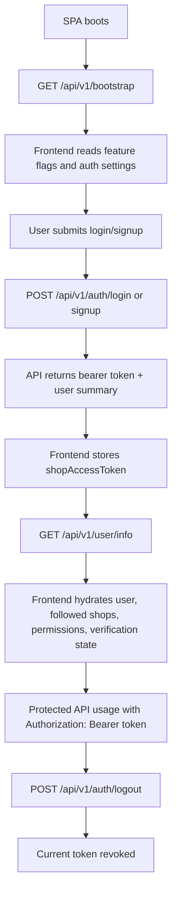

# Phase 2 Auth And Bootstrap Contract

## Decisions Locked Before Phase 2

### 1. Auth Strategy

- API authentication for `/api/v1/*` will use Laravel Sanctum personal access tokens.
- The frontend remains a bearer-token client and continues to store the token in `localStorage` as `shopAccessToken`.
- The backend will not depend on Blade session state for SPA runtime behavior.
- Protected API routes will use one consistent token-authenticated guard strategy.
- `GET /api/v1/user/info` is the sole authoritative frontend hydration endpoint after login.

### 2. Logout Behavior

- `POST /api/v1/auth/logout` revokes the current access token only.
- A future `logout-all-devices` endpoint may be added explicitly if needed.
- Multi-device login is allowed by default.

### 3. Token Lifecycle

- Access tokens are bearer tokens issued per device/session.
- Tokens should be named per client or device for auditability.
- Token expiration will be configured centrally.
- If expiration is enforced, the frontend must receive explicit `401` responses and re-authenticate cleanly.

### 4. Verification Policy

- Signup may create an unverified account.
- Verification status must be explicit in both auth responses and `user/info`.
- Access to sensitive flows can be restricted by policy or middleware, but the API must communicate status clearly.

## Auth Flow Diagram



## Bootstrap Contract

## Endpoint

- `GET /api/v1/bootstrap`

## Rules

- This endpoint is public.
- It is the only runtime bootstrap source for the SPA.
- It replaces `window.shopSetting` as the SPA initialization contract.
- Auth state is not required to call it.
- If an authenticated variant is ever needed later, it must preserve the base public shape and only add clearly documented fields.

## Payload Shape

```json
{
  "success": true,
  "data": {
    "appName": "Kidan",
    "meta": {
      "title": "Kidan",
      "description": "Storefront",
      "keywords": "fashion, journal",
      "image": "https://example.com/uploads/meta.png"
    },
    "appMetaTitle": "Kidan",
    "appMetaDescription": "Storefront",
    "appLogo": "https://example.com/uploads/logo.png",
    "appUrl": "https://example.com/",
    "cacheVersion": "1",
    "demoMode": false,
    "appLanguage": "en",
    "allLanguages": [
      {
        "name": "English",
        "code": "en",
        "flag": "🇬🇧",
        "rtl": 0
      }
    ],
    "allCurrencies": [
      {
        "id": 1,
        "name": "Naira",
        "symbol": "NGN",
        "code": "NGN",
        "exchange_rate": "1.0000"
      }
    ],
    "availableCountries": ["NG", "US"],
    "paymentMethods": [],
    "offlinePaymentMethods": [],
    "general_settings": {
      "product_comparison": 1,
      "wallet_system": 1,
      "club_point": 0,
      "club_point_convert_rate": "10",
      "conversation_system": 1,
      "sticky_header": 1,
      "affiliate_system": 1,
      "delivery_boy": 1,
      "support_chat": true,
      "pickup_point": true,
      "chat": {
        "customer_chat_logo": null,
        "customer_chat_name": "Support"
      },
      "social_login": {
        "google": 1,
        "facebook": 1,
        "twitter": 0
      },
      "currency": {
        "code": "NGN",
        "decimal_separator": "1",
        "symbol_format": "1",
        "no_of_decimals": "2",
        "truncate_price": "0"
      }
    },
    "addons": [],
    "banners": {
      "login_page": {
        "img": null,
        "link": null
      }
    },
    "refundSettings": {
      "refund_request_time_period": 604800,
      "refund_request_order_status": ["delivered"],
      "refund_reason_types": ["Damaged item", "Wrong item"]
    },
    "shop_registration_message": {
      "shop_registration_message_title": "Open your store",
      "shop_registration_message_content": "Start selling with us"
    },
    "cookie_message": {
      "cookie_title": "Cookies",
      "cookie_description": "We use cookies to improve your experience"
    },
    "authSettings": {
      "customer_login_with": "email_phone",
      "customer_otp_with": "email"
    }
  }
}
```

## Bootstrap Field Classification

### Static / Environment-backed

- `appUrl`
- `demoMode`
- fallback app name
- default app language

### Database-driven

- branding and meta
- languages
- countries
- payment methods
- offline payment methods
- banners
- refund settings
- auth settings
- registration copy
- cookie copy

### Feature Flags

- `general_settings.conversation_system`
- `general_settings.wallet_system`
- `general_settings.club_point`
- `general_settings.affiliate_system`
- `general_settings.delivery_boy`
- `general_settings.pickup_point`
- addon activation payload

## user/info Hydration Contract

## Endpoint

- `GET /api/v1/user/info`

## Rules

- This endpoint requires bearer-token auth.
- It is the authoritative source for authenticated frontend hydration.
- It should return enough information for the frontend store to initialize user-specific UI without extra “who am I” calls.

## Payload Shape

```json
{
  "success": true,
  "data": {
    "is_authenticated": true,
    "user": {
      "id": 1,
      "name": "Alex Doe",
      "email": "alex@example.com",
      "phone": "+2348000000000",
      "avatar": null,
      "user_type": "customer",
      "email_verified": true,
      "phone_verified": false,
      "verification_status": "verified",
      "wallet_balance": "12500.00",
      "club_points": 40
    },
    "followed_shops": [],
    "permissions": {
      "conversation_system": true,
      "wallet_system": true,
      "club_point": false
    },
    "profile": {
      "has_default_shipping_address": true,
      "has_default_billing_address": true,
      "profile_complete": true
    }
  }
}
```

## Auth Endpoint Response Rules

### Login Success

`POST /api/v1/auth/login`

```json
{
  "success": true,
  "message": "Login successful.",
  "data": {
    "token": "plain-text-token",
    "token_type": "Bearer",
    "expires_at": null,
    "user": {
      "id": 1,
      "name": "Alex Doe",
      "email": "alex@example.com",
      "user_type": "customer",
      "verification_status": "verified"
    }
  }
}
```

### Logout Success

`POST /api/v1/auth/logout`

```json
{
  "success": true,
  "message": "Logged out successfully."
}
```

## Route Protection Matrix

| Surface | Auth Required | Notes |
| --- | --- | --- |
| `GET /api/v1/bootstrap` | No | Public SPA bootstrap |
| `GET /api/v1/locale/{lang}` | No | Public locale hydration |
| `POST /api/v1/auth/login` | No | Public |
| `POST /api/v1/auth/signup` | No | Public |
| `POST /api/v1/auth/verify` | No | Public verification flow |
| `POST /api/v1/auth/resend-code` | No | Public verification flow |
| `POST /api/v1/auth/password/create` | No | Public password-reset request |
| `POST /api/v1/auth/password/reset` | No | Public password-reset submission |
| `POST /api/v1/auth/logout` | Yes | Revokes current bearer token |
| `GET /api/v1/user/info` | Yes | Authoritative hydration endpoint |
| Catalog endpoints | No | Public browsing |
| Cart endpoints | Mixed | Guest cart plus authenticated merge |
| Checkout endpoints | Yes | Order placement and shipping quote for owned user context |
| User account endpoints | Yes | Owned resources only |
| Wallet / affiliate / refunds | Yes | Also feature-gated |
| Delivery endpoints | Yes | Delivery-role only |
| Payment initialize | Yes | Authenticated or explicit guest contract if later required |
| Payment callbacks | No | Webhook/redirect verification flow, never session-dependent |

## Implementation Guardrails For Phase 2

- No session-based auth for API routes.
- No Blade-injected current-user state.
- No duplicate “current user” endpoints competing with `user/info`.
- No mixed guard strategy across protected API routes.
- No implicit verification assumptions.
- No frontend dependency on anything other than bearer token + bootstrap + `user/info`.
